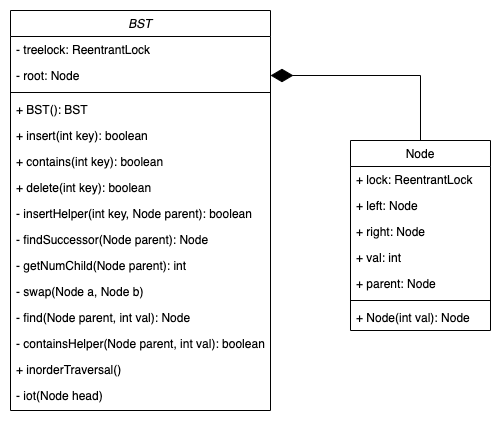
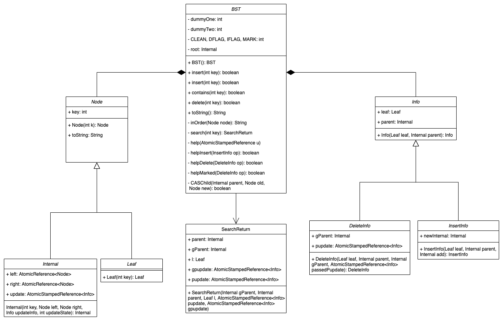
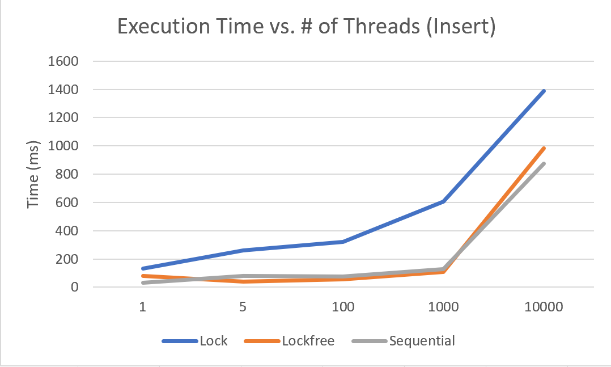
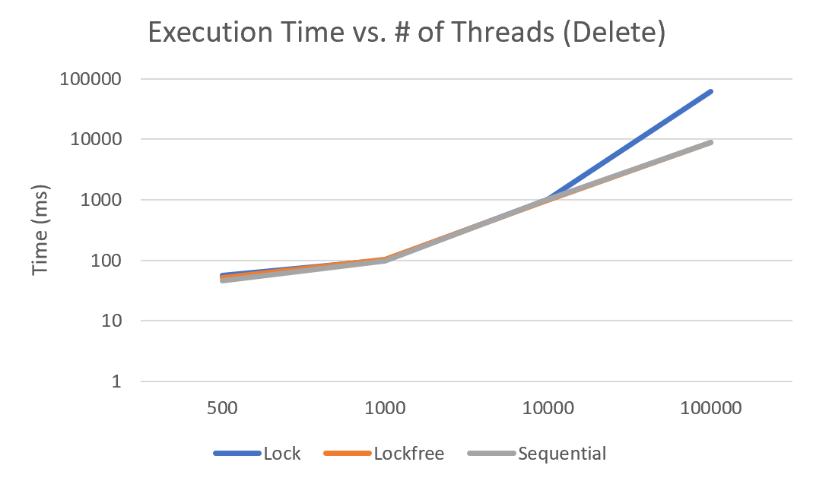
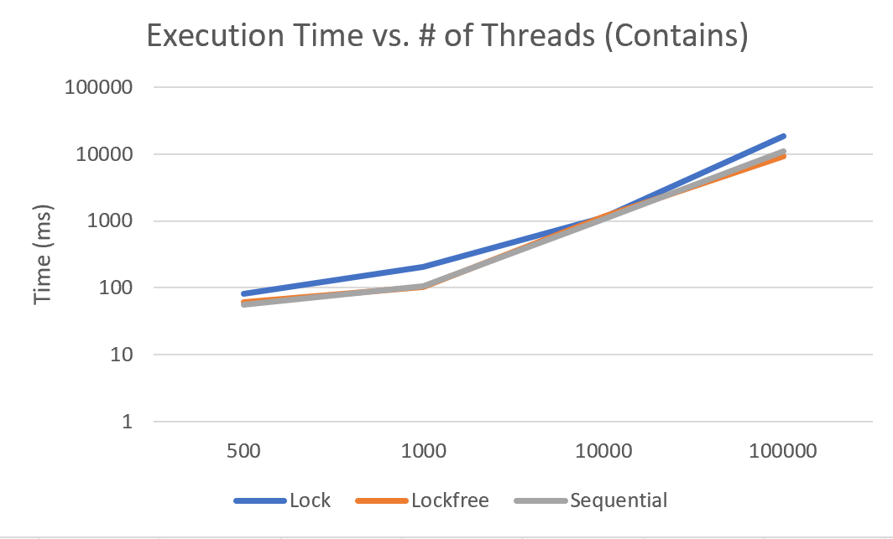
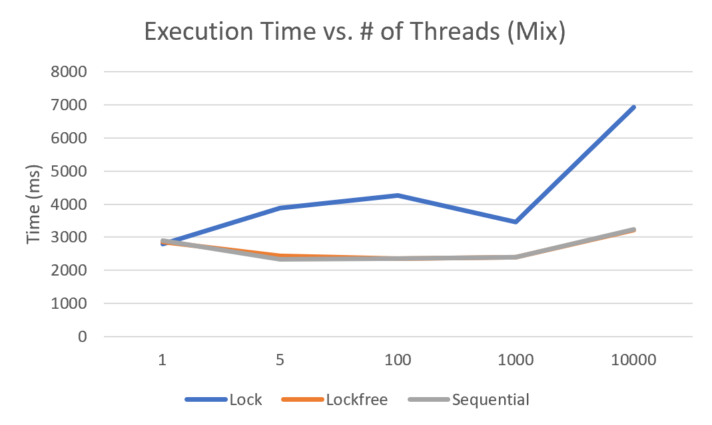

# 361C Term Project

The implementation of our 361C Term Project prompt: concurrent lockfree and fine-grained lock based binary search trees.

Lockfree and lock based concurrent red-black trees were also attempted but not completed. Lockfree and lock based
binary search tree implementations are complete and correct.

---

## Getting Started
Source code is divided into two high level packages: `lock` and `lockfree`. Within each is a 
`bst` package where the concurrent binary search tree implementation is located, and a `redblack`
package where the attempted concurrent red-black tree implementation is located.

The `lock` package also contains a `singlelock` subpackage where the sequential BST implementation is located.

Testing was performed using JUnit and the corresponding test suites are as follows:
* Lock based BST, Sequential BST Correctness: `src/lock/Tester.java`
* Lockfree BST Correctnedd: `src/lockfree/bst/Tester.java`
* Performance Comparison and Cross-Implementation Correctness: `src/Tester.java`

Follow these steps to run the tests:
1. download the java IDE of your choice (our project files are from IntelliJ)
2. create a new project (or import ours)
3. include our src/ folder as a project source module
4. add a JUnit run configuration for one of the following options or run the classes directly

---
## Binary Search Tree Overview

### Description
Allow insertion, deletion, and searching in a constrained _O(h)_ time where _h_ is the height of the tree being operated on.

#### Properties
* the left subtree of a node only contains nodes with keys less than the nodes key
* the right subtree of a node only contains nodes with keys greater than or equal to the nodes key
* the left and right subtrees are also binary search trees

### Lockbased Fine-Grained

### Lockfree
Our implementation is based on a paper by Ellen, Fatourou, Ruppert, and Breugel that can be found 
[here](https://dl.acm.org/doi/10.1145/1835698.1835736)

---

## Red-Black Tree Overview

### Description
Implements self-balancing into the binary search tree, ensuring optimal worst case operation times of _O(logn)_ instead of the _O(n)_ of traditional binary search trees.

#### Properties
* every node is either red or black
* the root node is black
* the external nodes are black
* a red nodes children are both black
* all paths from a node to its leaf descendants contain the same number of black nodes
* _also retains all the properties of a binary search tree_

### Lockbased Fine-Grained

_still in progress_

### Lockfree
_still in progress_

The attempted implmentation is based on a paper by Kim, Cameron, and Graham that can be found
[here](https://www.cs.umanitoba.ca/~hacamero/Research/RBTreesKim.pdf).

---

## Testing Outline
There are two types of test, correctness and performance comparison.

### Performance
There are four performance comparison tests. They all compare performance between the 
lock based, lock free, and sequential BST implementations for the three standard BST operations: insert, delete, and contains.

The **insert** test inserts 100,000 elements into the list five different ways: 1 thread x 100,000 inserts, 5 threads x 20,000 inserts, 
100 threads x 1,000 inserts, 1,000 threads x 100 inserts, and 10,000 threads x 10 inserts. Elapsed time for each implementation is 
recorded in milliseconds and shown below:

The **delete** test inserts random elements sequentially into the BST and then spins up a thread per element for concurrent deletion. It is run
for 500, 1,000, 10,000, and 100,000 elements. Elapsed time is recorded in milliseconds and measured only for the delete operation.
Results are shown below:

The **contains** test inserts random elements sequentially into the BST and then spins up a thread per element for concurrent calls to contains.
It is run for 500, 1,000, 10,000, and 100,000 elements. Elapsed time is recorded in milliseconds and measured only for the contains operation. 
Results are shown below:

The **mix** test inserts 100,000 elements in the same five variations as the **insert** test. These elements are randomly pulled from the range
1 - 25,000. Then, 25,000 delete threads are created to delete the values 1 - 25,000 from the tree concurrently. Elapsed time is recorded 
in milliseconds and measured from the start of the insert to the end of the delete operations. Results are shown below:

### Correctness
Each implementation contains its own suite of tests to ensure correctness. In addition, there are correctness tests that concurrently utilize
all three implementations and ensure their final outputs are equivalent.

### Running
See [Getting Started](#gettting-started) for instructions on how to run the tests.

## Credits
### Built With

* [Java SE 8](https://www.oracle.com/java/technologies/javase/javase-jdk8-downloads.html) - language used
* [IntelliJ](https://www.jetbrains.com/idea/) - IDE

### Authors

* **Dylan Cauwels** -- *lockfree team*
* **Carson Schubert** -- *lockfree team*
* **Sandeep Guggari** -- *lockbased team*
* **Shafaat Ahsen** -- *lockbased team*

<!-- See also the list of [contributors](https://github.com/your/project/contributors) who participated in this project. -->

### Acknowledgments
* [**Ellen, Faith & Fatourou, Panagiota & Ruppert, Eric & Breugel, Franck**. (2010). Non-blocking Binary Search Trees. Proceedings of the Annual ACM Symposium on Principles of Distributed Computing. 131-140. 10.1145/1835698.1835736.](https://dl.acm.org/doi/10.1145/1835698.1835736)
* [**Kim, Jong Ho & Cameron, Helen & Graham, Peter**. (2011). Lock-Free Red-Black Trees using CAS. Concurrency and Computation: Practice and Experience. 1-40.](https://www.cs.umanitoba.ca/~hacamero/Research/RBTreesKim.pdf)
* **Dr. Vijay Garg** -- _Professor_
